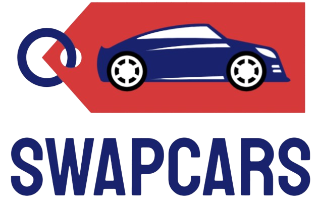

# SwapCars

## [Mira la web](https://swapcars.netlify.app/)

## Descripción

**-** El proyecto es una web de venta de coches de segunda mano donde la gente sube sus coches.
#### [Client Repo](https://github.com/AdriPriego/swapcars-client)
#### [Server Repo](https://github.com/AdriPriego/swapcars-server)

## Technologies & Libraries used

**Tecnologias -**  CSS, Javascript, React, axios, React Context, Express, ReactBoostrap, Cloudinary.

## Funcionalidades

**-** Registrarte y Inicair sesión, Subir un coche, Eliminar y Editar si el veichulo lo has subido tu, Crear Preguntas y editarlas y eliminarlas si son tuyas.

# Client Structure

**-**

- **404** - El usuario ve una pagina 404 si la ruta no es correcta
- **500** - El usuario ve una pagina de error cuando hay un error en el sentido tecnico
- **Pagina Principal** - El usuario ve la pagina principal sin tener que registrarse
- **sign up** - El usuario tiene una pagina para registrarse
- **login** - El usuario tiene una pagina para Iniciar sesion
- **logout** - El usuario si a iniciado session tiene un boton para salir de ella
- **events list** - El usuario tiene paginas para ver los veichulo
- **events create** - El usuario tiene pagnas para subir un veichulo

## Client Routes

**-** 

## React Router Routes (React App)
| Path                      | Page            | Components        | Permissions              | Behavior                                                      |
| ------------------------- | ----------------| ----------------  | ------------------------ | ------------------------------------------------------------  |
| `/`                       | Home            |                   | public                   | Home page                                                     |
| `/signup`                 | Signup          |                   | anon only `<IsAnon>`     | Signup form, link to login, navigate to homepage after signup |
| `/login`                  | Login           |                   | anon only `<IsAnon>`     | Login form, link to signup, navigate to homepage after login  |
| `/favoritos`                | Favoritos         | Favorites       | user only `<IsPrivate>`  | Navigate to homepage after logout, expire session             |
| `/cars`             |         | Añadri Coche, tarjeta de coche | user only `<IsPrivate>`  |                                     |
| `/car/edit`             | CarEdit       |                   | user only `<IsPrivate>`  | Shows all games on backlog                                    |
| `/car/category`       | CategoryList   | CarCard          | Private `<IsPrivate>`  |                                     |

## Other Components
- Navbar

## Services

- Auth Service
  - auth.login(user)
  - auth.signup(user)
  - auth.verify()

- Backlog Service
  - car.filter(type, status)
  - car.detail(id)
  - car.add(id)
  - car.delete(id)
  - car.update(id)
  
## Context

- auth.context
  
## Links

### Collaborators

[Developer 1 name](https://github.com/AdriPriego)

### Project

#### [Client Repo](https://github.com/AdriPriego/swapcars-client)
#### [Server Repo](https://github.com/AdriPriego/swapcars-server)

[Deploy Link](https://swapcars.netlify.app/)

### Slides

[Slides Link](https://www.canva.com/design/DAGAOpug_Ho/j6rLYouJnl_3SG1CxER0uA/view?utm_content=DAGAOpug_Ho&utm_campaign=designshare&utm_medium=link&utm_source=editor)